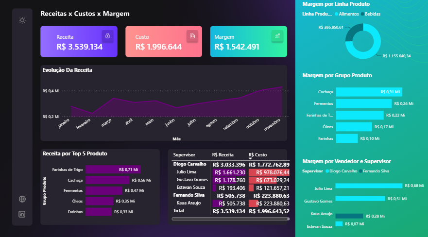

# 📊 Dashboard de Vendas

## 📌 Sobre o Projeto

Este projeto consiste em um **Dashboard de Vendas** desenvolvido no **Power BI**, com o objetivo de transformar dados brutos em informações estratégicas para apoiar a tomada de decisões.

O painel apresenta indicadores de desempenho relacionados à receita, custos e margem de lucro, além de análises por produto, supervisor e evolução das vendas ao longo do tempo.

---

## 🚀 Tecnologias e Conceitos Utilizados

- 📈 Power BI
- 🔄 Power Query
- 📊 DAX (Data Analysis Expressions)
- 🗄️ Modelagem de Dados
- 📑 Microsoft Excel

---

## 📋 Funcionalidades

- Visualização da Receita Total
- Visualização do Custo Total
- Cálculo da Margem de Lucro
- Evolução da Receita por período
- Ranking dos 5 produtos com maior receita
- Margem por Linha de Produto
- Margem por Grupo de Produto
- Receita e Custo por Supervisor

---

## 🧠 Conceitos Aplicados

### Modelagem de Dados
Estruturação do modelo relacional entre as tabelas de vendas e produtos para garantir consistência, desempenho e integridade das análises.

### Power Query
Processo de importação, limpeza, transformação e preparação dos dados antes da construção do dashboard.

### DAX
Criação de medidas e cálculos para obtenção de indicadores como:
- Receita Total
- Custo Total
- Margem de Lucro
- Agregações e métricas analíticas

---

## 📷 Dashboard

> Adicione aqui a imagem do dashboard.

---

## 📂 Arquivos do Projeto

- `Analise de vendas.pbix`
- `BaseVendasCompleta.xlsx`
- `CadastroProdutos.xlsx`

---

## 🎯 Objetivo

Este projeto foi desenvolvido com o propósito de demonstrar conhecimentos em Business Intelligence (BI), modelagem de dados, Power Query e DAX, aplicando boas práticas na construção de dashboards para análise de desempenho de vendas.

---

## 👨‍💻 Autor

**Miguel Santos**
GitHub: [github.com/miguelcarlos3](https://github.com/miguelcarlos3)
